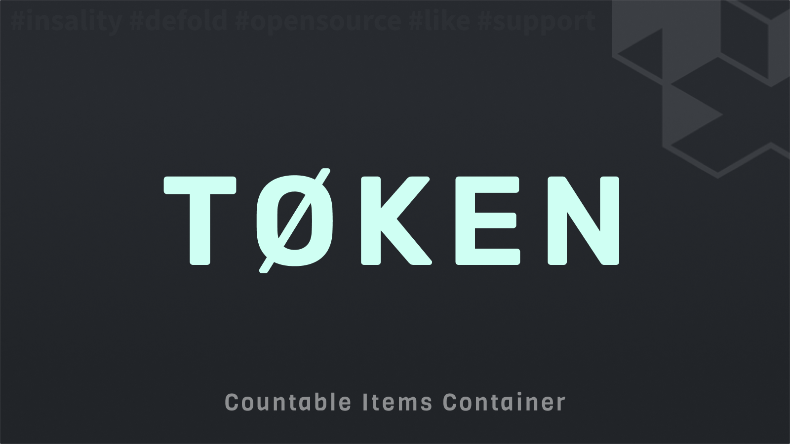

[](https://github.com/Insality/defold-token/tags)
[](https://github.com/Insality/defold-token/actions)
[](https://codecov.io/gh/Insality/defold-token)

[](https://github.com/sponsors/insality) [](https://ko-fi.com/insality) [](https://www.buymeacoffee.com/insality)


# Disclaimer

The library in development stage. May be not fully tested and README may be not full. If you have any questions, please, create an issue. This library is an adoptation of [Token](https://github.com/Insality/defold-eva/blob/master/eva/modules/token.lua) module from my [Defold-Eva](https://github.com/Insality/defold-eva) library.


# Token

**Token** - library designed for the [Defold](https://defold.com/) game engine to manage countable items such as money, lives, and other numeric values. This library provides a robust and flexible system for handling various token-related operations, including creation, management, and restoration of token values.


## Features

- **Token Management** - Create, delete, and manage tokens within containers.
- **Container Management** - Create, delete, and manage token containers.
- **Callbacks** - Customizable callbacks for token changes.
- **Token Groups** - Support for grouped token operations.
- **Token Restoration** - Configurable restoration mechanics for tokens.
- **Infinity Tokens** - Manage tokens with infinite time usage.


## Setup

### [Dependency](https://www.defold.com/manuals/libraries/)

Open your `game.project` file and add the following line to the dependencies field under the project section:

**[Defold Event](https://github.com/Insality/defold-event)**

```
https://github.com/Insality/defold-event/archive/refs/tags/5.zip
```

**[Defold Token](https://github.com/Insality/defold-token/archive/refs/tags/1.zip)**

```
https://github.com/Insality/defold-token/archive/refs/tags/1.zip
```

After that, select `Project ▸ Fetch Libraries` to update [library dependencies]((https://defold.com/manuals/libraries/#setting-up-library-dependencies)). This happens automatically whenever you open a project so you will only need to do this if the dependencies change without re-opening the project.

### Library Size

> **Note:** The library size is calculated based on the build report per platform

| Platform         | Library Size |
| ---------------- | ------------ |
| HTML5            | **4.68 KB**  |
| Desktop / Mobile | **9.01 KB**  |


### Glossary

- **Token**: A countable item such as money, lives, or other numeric values.
- **Container**: A collection of tokens.
- **Token Group**: A group of tokens that can be managed together and have a group id.
- **Token Lot**: A data with a price group id and reward group id. Can be used for shop items, for example.


### Token Configuration File [optional]

Create a configuration file for the Token module. Place your configuration file inside your [custom resources folder](https://defold.com/manuals/project-settings/#custom-resources) to ensure they are included in the build.

The configuration file should be a JSON file with the following structure. Each field in token definition is optional, and the module will use default values if they are not provided.

```json
{
	"tokens": {
		"damage": {
			"min": 1,
			"default": 1
		},

		"money": {
			"default": 100,
			"max": 99999
		}
	},

	"groups": {
		"reward_1": {
			"money": 100,
			"exp": 10
		},
		"price_1": {
			"crystal": 5
		}
	},

	"lots": {
		"shop_item_1": {
			"price": "price_1",
			"reward": "reward_1"
		}
	}
}
```

When the configuration file is ready, you can initialize the `Token` module by calling the `token.init(config_path)` function. This function should be called at the beginning of the game to load the configuration file and initialize the Token module.

```lua
token.init("/resources/token_config.json")
```


## API Reference

### Quick API Reference

```lua
token.init([config_or_path])
token.reset_state()

-- Events
token.on_token_change -- (container_id, token_id, amount, reason)
token.on_token_visual_change -- (container_id, token_id, amount)
token.on_token_restore_change -- (container_id, token_id, restore_config)

token.create_container(container_id)
token.delete_container(container_id)
token.clear_container(container_id)
token.is_container_exist(container_id)

token.get(container_id, token_id)
token.set(container_id, token_id, amount, reason)
token.add(container_id, token_id, amount, reason, visual_later)
token.pay(container_id, token_id, amount, reason, visual_later)
token.is_enough(container_id, token_id, amount)

token.get_many(container_id)
token.set_many(container_id, tokens, reason, visual_later)
token.add_many(container_id, tokens, reason, visual_later)
token.pay_many(container_id, tokens, reason, visual_later)
token.is_enough_many(container_id, tokens)

token.get_token_group(token_group_id)
token.add_group(container_id, token_group_id, reason, visual_later)
token.set_group(container_id, token_group_id, reason, visual_later)
token.pay_group(container_id, token_group_id, reason, visual_later)
token.is_enough_group(container_id, token_group_id)

token.create_restore_config()
token.set_restore_config(container_id, token_id, config)
token.get_restore_config(container_id, token_id)
token.set_restore_enabled(container_id, token_id, is_enabled)
token.is_restore_enabled(container_id, token_id)
token.remove_restore_config(container_id, token_id)
token.get_time_to_restore(container_id, token_id)

token.get_lot_reward(lot_id)
token.get_lot_price(lot_id)

token.add_infinity_time(container_id, token_id, seconds)
token.get_infinity_time(container_id, token_id)
token.set_infinity_time(container_id, token_id, seconds)
token.is_infinity_time(container_id, token_id)

token.get_visual(container_id, token_id)
token.add_visual(container_id, token_id, amount)
token.sync_visual(container_id, token_id)

token.get_total_sum(container_id, token_id)

token.set_logger([logger_instance])
```

### API Reference

Read the [API Reference](API_REFERENCE.md) file to see the full API documentation for the module.


## Use Cases

Read the [Use Cases](USE_CASES.md) file to see several examples of how to use the this module in your Defold game development projects.

## License

This project is licensed under the MIT License - see the [LICENSE](LICENSE) file for details.


## Issues and Suggestions

For any issues, questions, or suggestions, please [create an issue](https://github.com/Insality/defold-token/issues).


## 👏 Contributors

<a href="https://github.com/Insality/defold-token/graphs/contributors">
  
</a>


## ❤️ Support project ❤️

Your donation helps me stay engaged in creating valuable projects for **Defold**. If you appreciate what I'm doing, please consider supporting me!

[](https://github.com/sponsors/insality) [](https://ko-fi.com/insality) [](https://www.buymeacoffee.com/insality)
