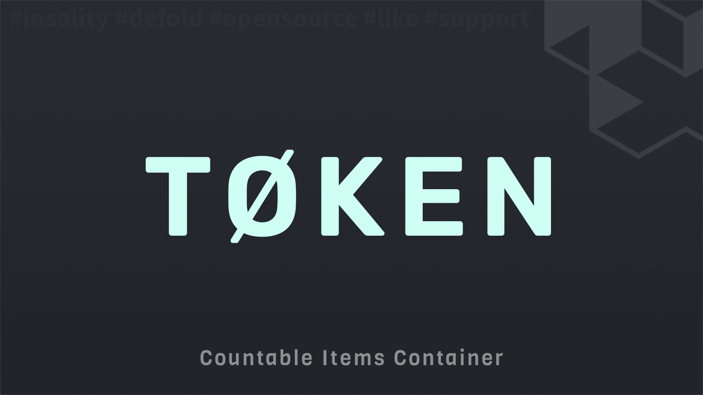

[](https://github.com/Insality/defold-token/tags)
[](https://github.com/Insality/defold-token/actions)
[](https://codecov.io/gh/Insality/defold-token)

[](https://github.com/sponsors/insality) [](https://ko-fi.com/insality) [](https://www.buymeacoffee.com/insality)


# Disclaimer

The library in **development stage**. May be not fully tested and README may be not full. If you have any questions, please, create an issue. This library is an adoptation of [Token](https://github.com/Insality/defold-eva/blob/master/eva/modules/token.lua) module from my [Defold-Eva](https://github.com/Insality/defold-eva) library.


# Token

**Token** - library designed for the [Defold](https://defold.com/) game engine to manage countable items such as money, lives, and other numeric values. This library provides a robust and flexible system for handling various token-related operations, including creation, management, and restoration of token values.


## Features

- **Token Management** - Create, delete, and manage tokens within containers.
- **Container Management** - Create, delete, and manage token containers.
- **Callbacks** - Customizable callbacks for token changes.
- **Token Groups** - Support for grouped token operations.
- **Token Restoration** - Configurable restoration mechanics for tokens.
- **Infinity Tokens** - Manage tokens with infinite time usage.


## Setup

### [Dependency](https://www.defold.com/manuals/libraries/)

Open your `game.project` file and add the following line to the dependencies field under the project section:

**[Defold Event](https://github.com/Insality/defold-event)**

```
https://github.com/Insality/defold-event/archive/refs/tags/13.zip
```

**[Defold Token](https://github.com/Insality/defold-token/archive/refs/tags/1.zip)**

```
https://github.com/Insality/defold-token/archive/refs/tags/3.zip
```

After that, select `Project ▸ Fetch Libraries` to update [library dependencies]((https://defold.com/manuals/libraries/#setting-up-library-dependencies)). This happens automatically whenever you open a project so you will only need to do this if the dependencies change without re-opening the project.

### Library Size

> **Note:** The library size is calculated based on the build report per platform

| Platform         | Library Size |
| ---------------- | ------------ |
| HTML5            | **4.68 KB**  |
| Desktop / Mobile | **9.01 KB**  |


### Glossary

- **Token**: A countable item such as money, lives, or other numeric values.
- **Container**: A collection of tokens.
- **Token Group**: A group of tokens that can be managed together and have a group id.
- **Token Lot**: A data with a price group id and reward group id. Can be used for shop items, for example.


## Basic Usage
```lua
local token = require("token.token")

token.init({
	["money"] = { default = 100, min = 0, max = 10000 },
	["exp"] = {},
	["level"] = { default = 1, min = 1, max = 100 },
})

token.get_state() -- get the current state for save/load
token.set_state(state) -- set the state for save/load

token.container("wallet"):add("exp", 100)
token.container("wallet"):add("level", 1)
token.container("wallet"):pay("money", 100)

-- Configs is not required to operate with tokens
token.container("skill"):add("damage", 100) -- Return token instance
token.container("skill"):get("damage") -- Return 100
```

## API Reference

### Quick API Reference

```lua
local token = require("token.token")

-- Initialize the token system
token.init([tokens_config_or_path], [config_group])
token.get_state()
token.set_state(new_state)
token.reset_state()

-- Containers
token.container(container_id, [config_group])
token.delete_container(container_id)
token.clear_container(container_id)
token.is_container_exist(container_id)

-- Data management
token.register_tokens(tokens, [config_group])
token.register_token_groups(groups)
token.register_lots(lots_data)
token.get_token_group(token_group_id)
token.get_lot_reward(lot_id)
token.get_lot_price(lot_id)
token.get_token_config(token_id)

-- System
token.set_logger([logger_instance])

-- Events
token.on_token_change -- (container_id, token_id, amount, reason)
token.on_token_visual_change -- (container_id, token_id, amount)
token.on_token_restore_change -- (container_id, token_id, restore_config)
```

```lua
local container = token.container("wallet")

-- Single Token
container:add(token_id, amount, [reason], [visual_later])
container:set(token_id, amount, [reason], [visual_later])
container:get(token_id)
container:pay(token_id, amount, [reason], [visual_later])
container:is_enough(token_id, amount)
container:is_empty(token_id)
container:is_max(token_id)

-- Multiple Tokens
container:add_many([tokens], [reason], [visual_later])
container:set_many([tokens], [reason], [visual_later])
container:pay_many(tokens, [reason], [visual_later])
container:is_enough_many([tokens])
container:get_many()

-- Token Groups
container:add_group(group_id, [reason], [visual_later])
container:set_group(group_id, [reason], [visual_later])
container:pay_group(group_id, [reason], [visual_later])
container:is_enough_group(group_id)

-- Visual Management
container:sync_visual(token_id)
container:add_visual(token_id, amount)
container:get_visual(token_id)

-- Info
container:get_total_sum(token_id)
container:get_token_config(token_id)

-- Restore Config
container:set_restore_config(token_id, config)
container:get_restore_config(token_id)
container:set_restore_config_enabled(token_id, is_enabled)
container:is_restore_config_enabled(token_id)
container:remove_restore_config(token_id)
container:reset_restore_timer(token_id)
container:get_time_to_restore(token_id)

-- Infinity Config
container:add_infinity_time(token_id, seconds)
container:is_infinity(token_id)
container:get_infinity_time(token_id)
container:set_infinity_time(token_id, time)
```

### API Reference

Read the [API Reference](API_REFERENCE.md) file to see the full API documentation for the module.


## Use Cases

Read the [Use Cases](USE_CASES.md) file to see several examples of how to use the this module in your Defold game development projects.


## License

This project is licensed under the MIT License - see the [LICENSE](LICENSE) file for details.


## Issues and Suggestions

For any issues, questions, or suggestions, please [create an issue](https://github.com/Insality/defold-token/issues).


## 👏 Contributors

<a href="https://github.com/Insality/defold-token/graphs/contributors">
  
</a>


## ❤️ Support project ❤️

Your donation helps me stay engaged in creating valuable projects for **Defold**. If you appreciate what I'm doing, please consider supporting me!

[](https://github.com/sponsors/insality) [](https://ko-fi.com/insality) [](https://www.buymeacoffee.com/insality)
